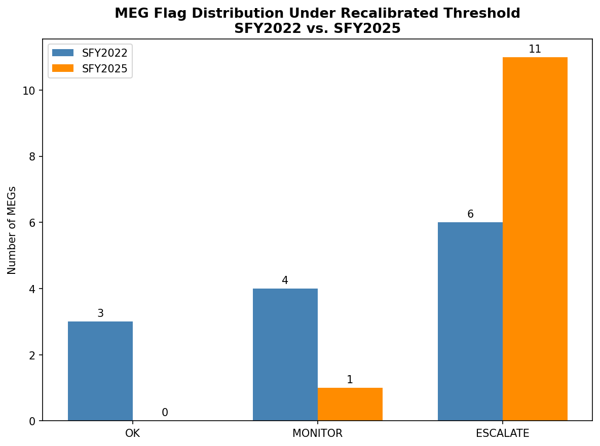

# Vermont Medicaid PMPM Reconciliation: SFY2022 vs. SFY2025

Two independent budget-vs-actual reconciliation analyses of Vermont Medicaid, built using the same schema, the same SQL pipeline, and the same statistically-derived variance threshold, applied to two fiscal years with almost nothing else in common.

See [SFY2022/README.md](SFY2022/README.md) and [SFY2025/README.md](SFY2025/README.md) for each year's full build process. This document covers what the comparison itself shows.

## Why compare these two years

SFY2022 sits inside the COVID-19 Public Health Emergency, when federal rules barred states from disenrolling Medicaid members for the duration of the emergency. SFY2025 sits after that policy ended and after the "unwinding" redetermination process had run its course. They are close to opposite conditions for a state Medicaid program, which makes them a useful pair for testing whether a single reconciliation methodology holds up across different years, or whether it was quietly tuned to one of them.

## The threshold had to be fixed before the comparison meant anything

Both years were originally checked against a flat 1% enrollment / 2% PMPM threshold. Under that threshold, both years flagged nearly every Medicaid Eligibility Group (MEG), which made them look superficially similar and made the threshold itself suspect. Real DVHA caseload and expenditure data from SFY2020 through SFY2024 showed why: normal year-over-year volatility in this system averages 6.3% for enrollment and 8.9% for PMPM, four to six times wider than the original threshold. The original number was measuring the floor of ordinary noise, not real abnormality.

Both years were rebuilt against a recalibrated threshold derived from that historical volatility: MONITOR at 1 standard deviation, ESCALATE at 1.5 standard deviations. This is a flat threshold rather than a category-specific one, a deliberate simplification for communicability over statistical precision, documented as such in each year's README rather than presented as fully rigorous.

## What the recalibrated threshold actually shows

| | SFY2022 | SFY2025 |
|---|---|---|
| MEGs reviewed | 13 | 12 |
| Fully within normal range | 3 | 0 |
| Flagged (Monitor or Escalate) | 10 | 12 |
|  Escalated | 6 | 11 |
| Average absolute PMPM variance | 8.72% | 29.13% |
| As-Passed budget miss | 14.73% | 14.71% |

Once the threshold reflects historical noise instead of an arbitrary number, the two years separate clearly. SFY2022's apparent crisis shrinks to a handful of outliers, three MEGs turn out to be entirely within normal range. SFY2025 does not shrink at all: every single MEG flags on at least one metric, and the typical PMPM variance runs more than three times the threshold itself.

## The same headline number, two different stories

Measured the same way in both years, As-Passed budget against actual, the portfolio missed by almost exactly the same percentage: 14.73% in SFY2022, 14.71% in SFY2025. That similarity is coincidental in magnitude and meaningful in what it hides, since the mechanism behind each miss has almost nothing in common.

**SFY2022 was a volume story.** The PHE continuous enrollment requirement kept people on Medicaid who would otherwise have cycled off during routine eligibility review. Enrollment in categories like General Adult came in 60.8% over budget. PMPM cost per person, by contrast, often stayed close to budget or even came in under it, since the retained population skewed toward lower-need members who would normally have been the ones removed.

**SFY2025 is a cost-intensity story.** Enrollment came in below budget in most categories, consistent with the post-unwinding contraction. But PMPM cost per person rose sharply almost everywhere, driven by a combination of factors documented in the SFY2025 README: a population composition shift toward costlier "stayers," specific legislated provider rate increases that took effect mid-year, and a smaller contribution from general medical inflation.

The more publicly discussed event, the federal PHE policy, produced the bigger headline dollar figure in its own year but a comparatively moderate per-metric statistical signal once measured against real historical normal. The less-discussed shift in SFY2025 produced a similar headline number but a far more extreme statistical signal. The famous story was not the more abnormal one once the threshold was actually correct.

## What this comparison does not establish

This analysis uses two data points for budget-vs-actual miss, not enough for a statistically rigorous distribution on its own. The recalibrated threshold is built from a longer five-year run of actual-to-actual volatility instead, used as the closest available substitute, and documented as such rather than presented as equivalent to a true forecast-miss distribution. A truly rigorous version of this threshold would use category-specific, credibility-weighted bands rather than one flat number, and would ideally be built from five or more years of budget-vs-actual misses rather than two. Both are identified as a clear next step rather than treated as already solved.

The SFY2025 cost-intensity drivers are documented from public legislative and budget records, not from claims-level data, so the relative contribution of each mechanism (population mix, rate increases, inflation) could not be precisely decomposed.

---

This project is part of an independent data analytics portfolio. All figures are derived from publicly available Vermont state government reports.
