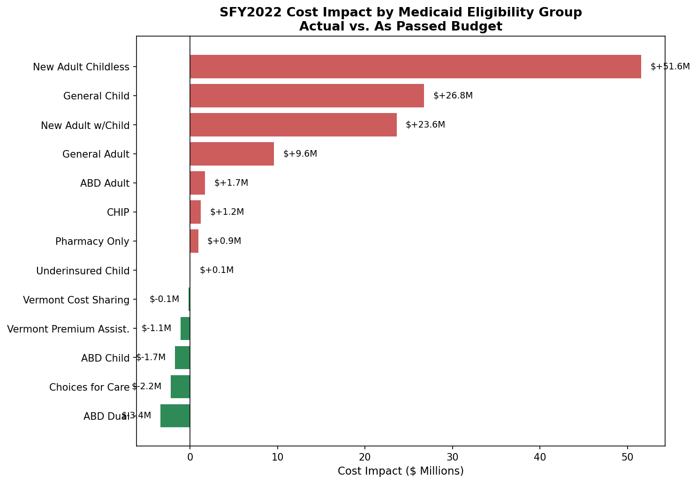
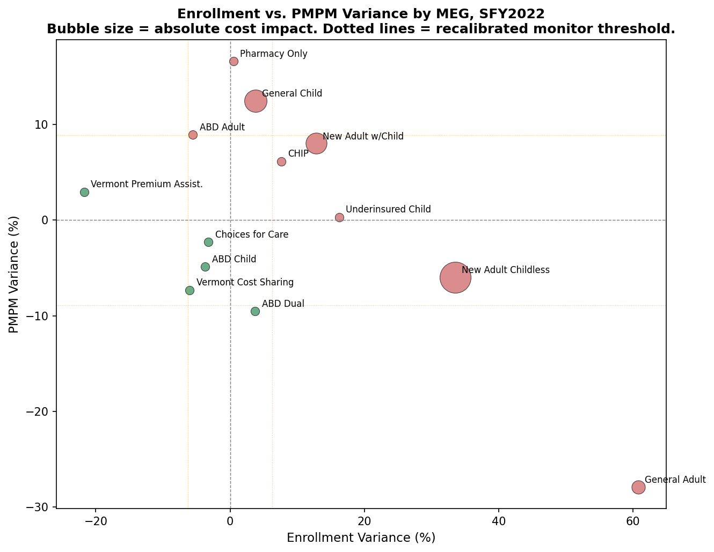

# Vermont Medicaid PMPM Reconciliation - SFY2022

A budget-vs-actual reconciliation framework for Vermont Medicaid (Green Mountain Care). Built first in Excel as a simulation, then rebuilt with published DVHA data and reimplemented in PostgreSQL.

## The Process

### Phase 1: Build the model before the data existed

I started this project before I had a dataset to compare against the budget. Vermont publishes a budget report for Medicaid (the SFY2022 Annual PMPM Legislative Report), but at the time I hadn't located a matching actuals source. Rather than wait, I built the full reconciliation framework, schema, variance calculations, threshold-based flagging logic, and the findings and resolution workflow, using the published budget figures alongside actuals I constructed myself to stand in for the real thing.

### Phase 2: Find the actuals

I located Vermont's quarterly Medicaid Enrollment & Expenditure Report, required under 33 V.S.A. § 1901f, which DVHA submits to the Vermont General Assembly. The Q4 SFY2022 edition, covering the full year through June 30, 2022, gave me actual enrollment and expenditure figures by Medicaid Eligibility Group (MEG).

### Phase 3: Reconcile two reports that don't line up cleanly

Three issues came up once I tried to load this data into the existing model:

1. **Two budgets for the same fiscal year.** The PMPM Legislative Report uses the original "As Passed" budget. The Enrollment & Expenditure Report compares actuals against a different, mid-year revised budget (the Budget Adjustment Act, or "BAA"). I kept the As Passed budget throughout, since the model was already built around it, and a planned-vs-actual comparison tells a more useful story than a revised-plan-vs-actual one.

2. **Three reporting scopes in the same report.** The Enrollment & Expenditure Report presents the same data three ways: DVHA-only, All AHS, and All AHS + AOE. Each gives different numbers for the same MEG. I used DVHA-only, since the budget report is explicitly scoped to the DVHA program.

3. **A mismatch in one category.** Choices for Care, Vermont's long-term care waiver program, is one line in the budget report but splits into "Traditional" and "Acute" in the actuals report. Under DVHA-only scope, Traditional reports $0. I used the Acute sub-category as the closest valid comparison and documented the exclusion in both the spreadsheet and the SQL findings log.

### Phase 4: Rebuild with the actual numbers

Once the actuals were loaded, the reconciliation produced a much bigger result than the original simulated version, every single MEG flagged under the original flat 1%/2% threshold. The cause traces back to a federal policy, not a budgeting mistake. Under the Families First Coronavirus Response Act, states were required to keep nearly all Medicaid enrollees continuously covered for the duration of the COVID-19 public health emergency, in exchange for increased federal funding ([KFF, "10 Things to Know About the Unwinding of the Medicaid Continuous Enrollment Provision"](https://www.kff.org/medicaid/10-things-to-know-about-the-unwinding-of-the-medicaid-continuous-enrollment-provision/)). General Adult enrollment alone came in 60.8% over budget.

### Phase 5: Rebuild in SQL

I reimplemented the full reconciliation in PostgreSQL:

- Designed a three-table relational schema
- Loaded the data with `COPY ... FROM`, after working through a Windows/OneDrive permission issue
- Wrote variance calculation and threshold-flagging queries using `CASE` logic
- Split findings into one row per flagged metric instead of one row per MEG, for cleaner structure
- Built a summary view that pivots the findings back to one row per MEG using `MAX(CASE WHEN ... THEN ... END)`, which keeps enrollment and PMPM findings in separate columns rather than concatenating them into one text field

### Phase 6: Recalibrate the threshold

The original flat 1%/2% threshold was an arbitrary starting assumption from when this project was first built with simulated data, not derived from any benchmark. Once I had a second year of real data (see the SFY2025 companion project), the same flat threshold flagged nearly every MEG in both years regardless of how different the underlying causes were. That pattern raised a real question: was the threshold actually measuring abnormality, or just measuring the natural background noise of the system?

To check, I pulled real DVHA caseload, expenditure, and PMPM data for SFY2020 through SFY2024 by MEG, and calculated the standard deviation of year-over-year actual change for each category. The average came out to 6.3% for enrollment and 8.9% for PMPM, four to six times wider than the original 1%/2% threshold. The original threshold was set well below the level of ordinary year-to-year fluctuation in this system, which is why it flagged almost everything regardless of whether anything unusual was actually happening.

I recalibrated to a two-tier threshold based on that historical volatility: MONITOR at 1 standard deviation (6.3% enrollment, 8.9% PMPM), ESCALATE at 1.5 standard deviations (9.5% enrollment, 13.4% PMPM). Under this corrected threshold, SFY2022 looks meaningfully different: 3 of 13 MEGs (ABD Child, Choices for Care, Vermont Cost Sharing) are fully within normal range, and only 6 genuinely escalate.

This is a known simplification, worth stating plainly rather than treating as fully rigorous. Real actuarial practice typically uses category-specific or credibility-weighted thresholds, since smaller populations naturally produce noisier percentage swings than larger ones independent of anything being wrong. A flat threshold trades that statistical precision for communicability, which is a defensible choice for a report modeled on legislative reporting, but it is a simplification, not the more rigorous alternative. The historical volatility used here also measures year-over-year actual change, not historical budget-vs-actual miss directly, since only two years of real budget-vs-actual data exist at the time of writing, not enough for a real distribution. Year-over-year actual volatility was used as the closest defensible substitute.

## Key Findings

| Metric | Budget | Actual | Variance |
|---|---|---|---|
| Total Enrollment | 191,656 | 211,764 | +20,108 (+10.5%) |
| Total Annual Cost | $726.9M | $834.0M | +$107.1M |
| MEGs Escalated (recalibrated) | - | - | 6 of 13 |
| MEGs Fully Within Normal Range | - | - | 3 of 13 |

**Top 3 cost drivers:**
1. New Adult Childless: enrollment +33.53%, PMPM -5.99%, cost impact +$51.6M
2. New Adult w/Child: enrollment +12.81%, PMPM +8.02%, cost impact +$23.6M
3. General Child: enrollment +3.77%, PMPM +12.45%, cost impact +$26.8M

**Root cause:** Federal PHE continuous enrollment provisions drove enrollment well above the As-Passed budget's pre-pandemic assumptions across nearly every adult and family eligibility category. This is consistent with the documented national mechanism and the direction of every variance in this analysis. It has not been verified against person-level claims data for Vermont specifically, so the magnitude should be read as illustrative of a documented national pattern rather than a fully isolated causal proof.

**Known limitation:** Choices for Care figures reflect the Acute sub-category only. Traditional long-term care is excluded under DVHA-only reporting scope, where it reports $0 expenditure.

## Visualizations



Ranked by dollar impact. New Adult Childless is the single largest driver despite a moderate percentage swing, since the population size is large enough that even a moderate variance produces a large dollar effect.



Position shows the two drivers (enrollment drift on the x-axis, PMPM drift on the y-axis). Size and color show the financial outcome. Dotted lines mark the recalibrated monitor threshold. A MEG can sit far from center on both axes and still land favorably if the two effects offset each other, ABD Dual is an example of this in the data.

Both charts are built in `medicaid_budget_reconcil_2022_viz.ipynb`.

## Reproducing This Analysis

**Step 1: Create the database.**
In DBeaver, right-click Databases, select Create Database, name it `medicaid_pmpm`, click OK.

**Step 2: Run the setup script.**
Open `SQL/00_setup.sql` and run it to create the three tables.

**Step 3: Load the data.**
Open `SQL/01_load_data_copyfrom.sql`, update the three file paths to wherever you saved the CSVs locally (avoid OneDrive-synced folders, which can cause a permission error), then run it.

**Step 4: Run the analysis.**
Run `SQL/02_analysis_queries.sql` for the seven flagging and ranking queries, then `SQL/03_summary_view.sql` to build the pivoted summary view.

## Repository Structure

```
├── Vermont_Medicaid_PMPM_Reconciliation_SFY2022.xlsx
├── medicaid_budget_reconcil_2022_viz.ipynb
├── SQL/
│   ├── 00_setup.sql
│   ├── 01_load_data_copyfrom.sql
│   ├── 02_analysis_queries.sql
│   └── 03_summary_view.sql
├── budget_reference_clean.csv
├── reconciliation_clean.csv
├── findings_log.csv
├── cost_impact_by_meg.png
└── enroll_var_v_pmpm_var_by_meg.png
```

## Tools Used

**Excel:** financial modeling, variance calculations, conditional flagging, summary dashboard
**SQL (PostgreSQL):** relational schema design, COPY-based data loading, CASE-based threshold flagging, MAX(CASE WHEN...) pivoting, view creation
**Python:** pandas for data loading, matplotlib for the two charts above

## Data Sources

- **Budget:** [DVHA SFY2022 Annual PMPM Legislative Report](https://dvha.vermont.gov/sites/dvha/files/doc_library/SFY2022%20Annual%20PMPM%20Legislative%20Report_2.pdf), As Passed budget, submitted September 15, 2022
- **Actuals:** [DVHA Medicaid Program Enrollment & Expenditure Quarterly Report, Q4 SFY22 YTD](https://dvha.vermont.gov/sites/dvha/files/doc_library/Medicaid%20Program%20EE%20SFY%2022%20YTD%20QE0622_.pdf), DVHA-only scope, submitted under 33 V.S.A. § 1901f
- **Root cause context:** [KFF, "10 Things to Know About the Unwinding of the Medicaid Continuous Enrollment Provision"](https://www.kff.org/medicaid/10-things-to-know-about-the-unwinding-of-the-medicaid-continuous-enrollment-provision/)

A companion project applying the same recalibrated methodology to SFY2025 is available, see the comparative analysis for how the two years differ.

---

This project is part of an independent data analytics portfolio. All figures are derived from publicly available Vermont state government reports.
