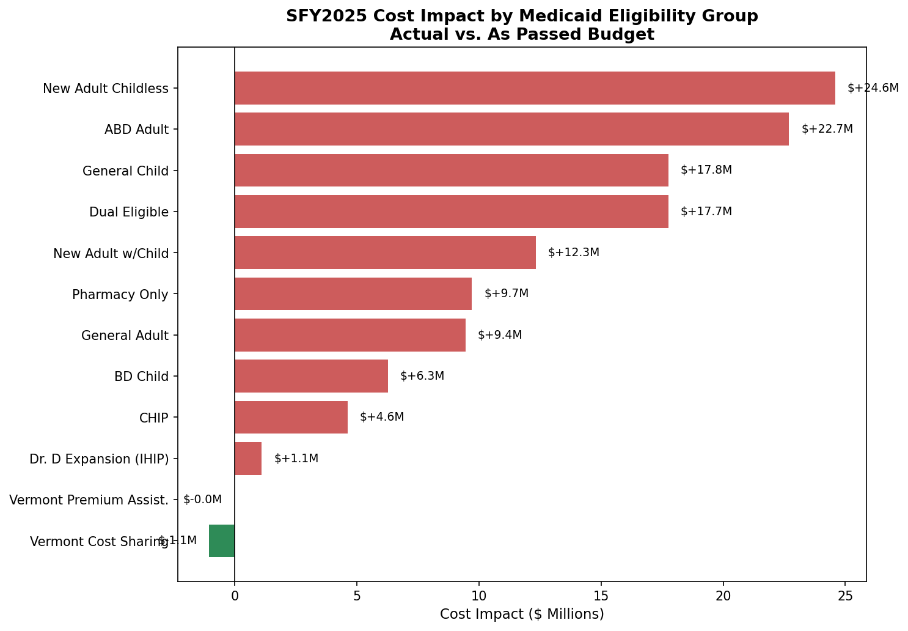
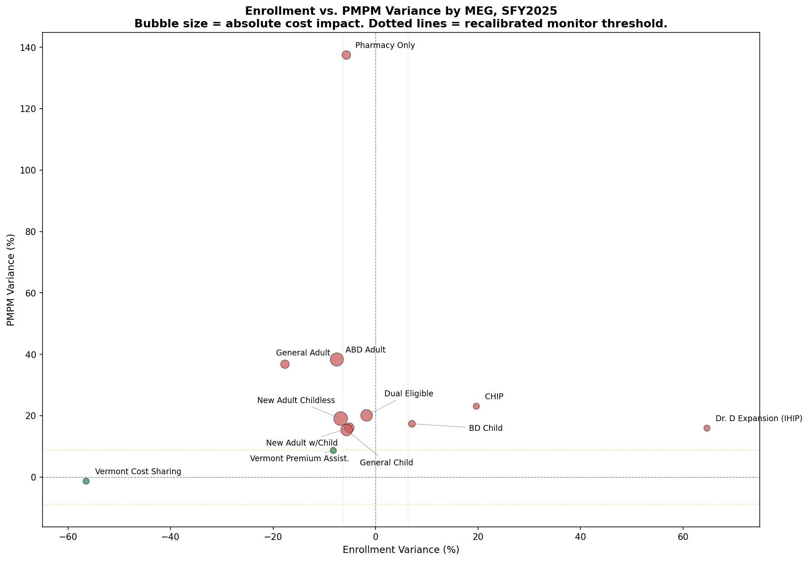

# Vermont Medicaid PMPM Reconciliation - SFY2025

A companion analysis to the SFY2022 project, applying the same budget-vs-actual reconciliation framework to the most recent full fiscal year of real Vermont Medicaid data, to see how forecasting accuracy and cost drivers compare across two very different years.

## The Process

### Finding a budget that no longer exists in its original format

The standalone PMPM Legislative Report used as the budget source for SFY2022 stopped being published after that year. The dedicated DVHA report page lists only SFY2019 through SFY2022. Finding an SFY2025 equivalent meant a different kind of search than SFY2022's did.

The actuals side was straightforward: Vermont's quarterly Enrollment & Expenditure Report is a recurring statutory requirement, and the Q4 SFY2025 edition exists in the same format as SFY2022's.

The budget side took more digging. Vermont's larger Annual Report and Budget Book documents retroactively report the prior year's finalized "As Passed" budget alongside forward-looking projections, since a budget book written before a fiscal year's budget is passed can only show a Governor's Recommendation, not the final number. The SFY2026 Budget Book, published after SFY2025's budget had been finalized, contains a real "SFY 2025 As Passed" column by MEG. That is the source used here.

### Verifying the scope match

Before trusting this figure, I checked it against the budget book's own SFY2025 BAA (mid-year revised budget) and against the DVHA-only actuals column in the Q4 report. The As-Passed PMPM for ABD Adult matched the Budget Book exactly ($846.95), and the DVHA-only actual PMPM ($1,171.49) landed close to the BAA figure ($1,176.81), which makes sense since the BAA is itself informed by real mid-year spending. That consistency confirmed the comparison was scoped correctly: As-Passed budget against DVHA-only actuals, the same methodology used for SFY2022.

### A different MEG structure

Vermont's 1115 waiver changed eligibility categories during this period. Choices for Care no longer exists as a standalone MEG, its costs are now distributed across other eligibility groups. The Optional Children's MEG was folded into General Child. A new category, Dr. D Expansion (IHIP), began in July 2022 and appears here for the first time. This analysis covers 12 MEGs instead of SFY2022's 13.

### Applying the same recalibrated threshold

Rather than start from another arbitrary number, this analysis uses the same recalibrated threshold built for SFY2022: MONITOR at 6.3% enrollment / 8.9% PMPM (1 historical standard deviation), ESCALATE at 9.5% / 13.4% (1.5 standard deviations). Holding the threshold constant across both years is what makes the comparison meaningful.

## Key Findings

| Metric | Budget | Actual | Variance |
|---|---|---|---|
| Total Enrollment | 199,751 | 185,704 | -14,047 (-7.0%) |
| Total Annual Cost | $851.1M | $976.3M | +$125.2M |
| MEGs Escalated (recalibrated) | - | - | 11 of 12 |
| MEGs Fully Within Normal Range | - | - | 0 of 12 |

**Top 3 cost drivers:**
1. New Adult Childless: enrollment -6.80%, PMPM +19.07%, cost impact (largest in portfolio)
2. ABD Adult: enrollment -7.53%, PMPM +38.32%
3. General Child: enrollment -5.62%, PMPM +15.35%

### The headline comparison to SFY2022

Measured the same way (As-Passed budget vs. actual, same percentage basis), SFY2022 missed its budget by 14.73%. SFY2025 missed by 14.71%. Nearly identical, despite opposite underlying mechanisms.

SFY2022 was an enrollment-volume story: the federal PHE continuous enrollment requirement drove enrollment far above plan, while PMPM cost per person often stayed close to or even below budget. SFY2025 is a cost-intensity story: enrollment came in below budget in most categories, consistent with post-unwinding redetermination, while PMPM cost per person rose sharply in nearly every category.

This shows up clearly under the recalibrated threshold. SFY2022's average absolute PMPM variance was 8.72%, sitting almost exactly at the new 8.9% threshold, meaning the typical SFY2022 category was right at the edge of normal. SFY2025's average absolute PMPM variance was 29.13%, more than three times the threshold. The more famous, more documented event (the PHE) produced the larger headline dollar number in its own year, but a comparatively moderate per-metric signal once measured against real historical normal. The quieter, less-discussed shift in SFY2025 produced a smaller headline number but a far more statistically extreme signal.

### What is driving the SFY2025 PMPM increase

No single cause fully explains variances in the 15% to 38% range seen across most categories. Three distinguishable mechanisms appear to be contributing:

**Population composition shift.** DVHA's own budget narrative documents that the population retained after post-PHE redeterminations ("stayers") skewed costlier on average across most adult enrollment groups, since members who would otherwise have cycled off during routine eligibility review were instead retained continuously through the PHE.

**Legislated provider rate increases.** Vermont's Global Commitment Register documents specific rate increases that took effect during SFY2025, including for Department of Disabilities, Aging, and Independent Living (DAIL) services, community-based mobile crisis services, and Department of Mental Health fee-for-service rates. Several of these had comment periods closing mid-2025, after the As-Passed budget for the year had already been finalized, making them unbudgeted additions rather than a forecasting oversight. Where a rate increase affects a population that is also using more services per person, as the stayer effect would predict, the two factors compound rather than offset.

**General medical inflation.** Confirmed but minor. National medical care inflation ran between 2.5% and 4.2% during this period, far too small on its own to explain variances several times that size.

A fourth factor, newly covered benefits added during SFY2025, was identified in legislative records but not quantified here.

These mechanisms could not be individually decomposed without category-level claims data, which is not available in the summary reports this analysis draws from.

**Pharmacy Only data quality note:** This category shows a PMPM variance of +137.49%, an order of magnitude larger than any other finding in this analysis, and inconsistent with the Budget Book's own BAA and Governor's Recommendation trendline for VPharm, which stayed in the $64 to $77 PMPM range across multiple years. National GLP-1 weight-loss drug cost growth was investigated and ruled out as a cause, since Vermont Medicaid does not cover GLP-1 medications for weight-loss indications. The Budget Book's own description of VPharm confirms its figures represent actual gross paid claims, ruling out a subsidy-only reporting basis as the explanation. The most likely remaining explanation is a gross-versus-net (rebate-adjusted) reporting difference between the two source documents: Vermont's pharmacy cost reporting elsewhere shows gross drug costs running roughly three times net costs after manufacturer rebates. This could not be confirmed from public data alone and is documented as an open question rather than presented as resolved.

## Visualizations



Every category shows a dollar impact in the same direction, consistent with a portfolio-wide cost-intensity shift rather than a few isolated outliers.



Nearly every MEG clusters in negative enrollment, positive PMPM territory, the visual signature of the post-unwinding pattern described above. Compare this to the SFY2022 version of this chart, where the cluster sits in the opposite quadrant.

Both charts are built in `medicaid_budget_reconcil_2025_viz.ipynb`.

## Reproducing This Analysis

**Step 1: Create the database.**
In DBeaver, right-click Databases, select Create Database, name it `medicaid_pmpm`, click OK.

**Step 2: Run the setup script.**
Open `SQL/00_setup.sql` and run it to create the three tables.

**Step 3: Load the data.**
Open `SQL/01_load_data_copyfrom.sql`, update the three file paths to wherever you saved the CSVs locally, then run it.

**Step 4: Run the analysis.**
Run `SQL/02_analysis_queries.sql` for the seven flagging and ranking queries, then `SQL/03_summary_view.sql` to build the pivoted summary view.

## Repository Structure

```
├── Vermont_Medicaid_PMPM_Reconciliation_SFY2025.xlsx
├── medicaid_budget_reconcil_2025_viz.ipynb
├── SQL/
│   ├── 00_setup.sql
│   ├── 01_load_data_copyfrom.sql
│   ├── 02_analysis_queries.sql
│   └── 03_summary_view.sql
├── budget_reference_clean.csv
├── reconciliation_clean.csv
├── findings_log.csv
├── cost_impact_by_meg.png
└── enroll_var_v_pmpm_var_by_meg.png
```

## Tools Used

**Excel:** financial modeling, variance calculations, conditional flagging, summary dashboard
**SQL (PostgreSQL):** relational schema design, COPY-based data loading, CASE-based threshold flagging, MAX(CASE WHEN...) pivoting, view creation
**Python:** pandas for data loading, matplotlib for the two charts above

## Data Sources

- **Budget:** [DVHA Annual Report and Budget Book SFY2026](https://dvha.vermont.gov/sites/dvha/files/documents/DVHA_24_26_AnnualReportAndBudgetBook_0.pdf), SFY2025 "As Passed" column, retroactively reported (DVHA-only scope)
- **Actuals:** [DVHA Medicaid Program Enrollment & Expenditure Quarterly Report, Q4 SFY25 YTD](https://dvha.vermont.gov/sites/dvha/files/documents/SFY25Q4-Medicaid-Program-EE-YTD.pdf), DVHA-only scope, submitted under 33 V.S.A. § 1901f
- **Provider rate increases:** [Vermont Global Commitment Register, 2025 Proposed Policies](https://humanservices.vermont.gov/dvha/about-us/medicaid-administration/global-commitment-register/proposed-policies/2025-proposed)
- **Population composition ("stayer effect"):** [Governor's Recommended Budget Adjustment (BAA): SFY2025 Budget Narrative](https://legislature.vermont.gov/Documents/2026/Workgroups/House%20Health%20Care/FY%202025%20Budget%20Adjustment/W~DaShawn%20Groves~DVHA%20FY25%20BAA%20Narrative~1-23-2025.pdf)
- **Medical inflation context:** [Peterson-KFF Health System Tracker, "How does medical inflation compare to inflation in the rest of the economy?"](https://www.healthsystemtracker.org/brief/how-does-medical-inflation-compare-to-inflation-in-the-rest-of-the-economy/)
- **Continuous enrollment policy background:** [KFF, "10 Things to Know About the Unwinding of the Medicaid Continuous Enrollment Provision"](https://www.kff.org/medicaid/10-things-to-know-about-the-unwinding-of-the-medicaid-continuous-enrollment-provision/)
- **Pharmacy gross-vs-net cost context:** [DVHA Pharmacy Best Practices and Cost Control Report, October 27, 2023](https://legislature.vermont.gov/assets/Legislative-Reports/DVHA-Pharmacy-Best-Practices-Cost-ControlFINAL-10.27.2023.pdf)

---

This project is part of an independent data analytics portfolio. All figures are derived from publicly available Vermont state government reports.
